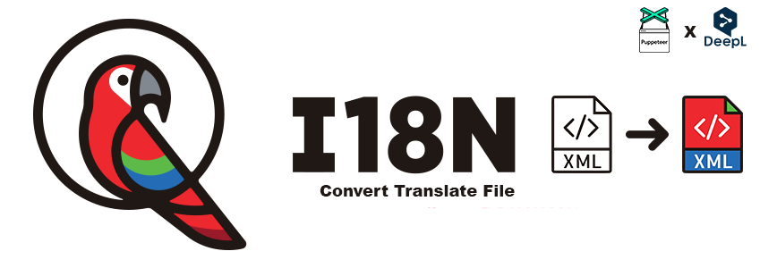

# i18n XML converter

<p align="center">

  <h3 align="center">i18n XML converter</h3>

<div align="center">
  <a href="https://github.com/Magictruks/i18n-convert-translate-file">
    
  </a>
</div>

  <p align="center">
    Tools to convert an XML (or XLF) file into the language of your choice
  </p>

<details open="open">
  <summary>Table of Contents</summary>
  <ol>
    <li>
      <a href="#about-the-project">About The Project</a>
      <ul>
        <li><a href="#preambule">Preambule</a></li>
         <li><a href="#feature">Feature</a></li>
      </ul>
    </li>
    <li>
      <a href="#getting-started">Getting Started</a>
      <ul>
        <li><a href="#installation">Installation</a></li>
      </ul>
    </li>
    <li>
      <a href="#usage">Usage</a>
      <ul>
        <li><a href="#language">Language</a></li>
        <li><a href="#translate">Translate</a></li>
      </ul>
    </li>
    <li><a href="#contact">Contact</a></li>
  </ol>
</details>

## About The Project

### Preambule

<p align="justify">
    The purpose of this tool is to take an XML or XLF file generated by i18n and output a translated file in the language of your choice.
    I don't use APIs because most of them are not free and this limits the number of words to translate per file. That's why I use puppeteer to get the translation of the word entered on the website https://www.deepl.com/translator
</p>

### Feature

Present Functionality :

- Translate all words
- Transalte only untarget words


## Get Started

### Installation

  ```shell
  npm install
  ```

In index.js, change the variables according to your case :

- pathIn : the path of the input file
- pathOut : the path you want in output

- sourceLanguage : the language of the input file
- targetLanguage : this language of the output file

Run translate

  ```shell
  npm run start
  ```
## Usage

### Language

<p align="justify">You can add a language that is not in the list of languages in the enum/language.enum.js file. Make sure that the instructions you want to add are compatible with Deepl.

(useful link: http://www.lingoes.net/en/translator/langcode.htm)</p>

### Translate

<p align="justify">Translate object has two methods :

- onlyUntarget() -> By default, just translate words who hasn't target
- all() -> Translate and replace all words
  
The waiting time between each request is 2000 ms. Feel free to increase this time if you see that the algorithm does not have enough time to find the translation (classes > tranlate.class.js > _searchTrad).
  
</p>


## Contact

<p align="justify">If you want me to add features or modify some of them, don't hesitate to contact me.</p>

Turchini Axel - [Linkedin](www.linkedin.com/in/axelturchini) - turchini.axel@gmail.com

Project Link: [https://github.com/Magictruks/i18n-convert-transalte-file](https://github.com/Magictruks/i18n-convert-translate-file)
